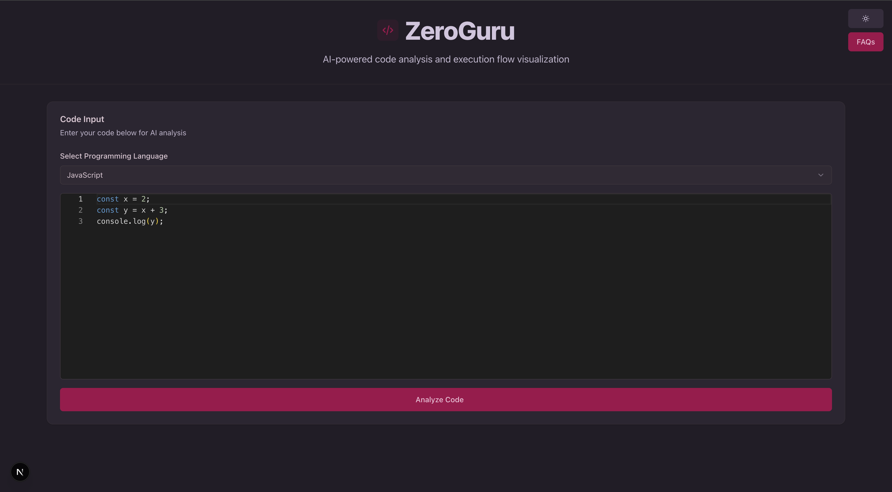
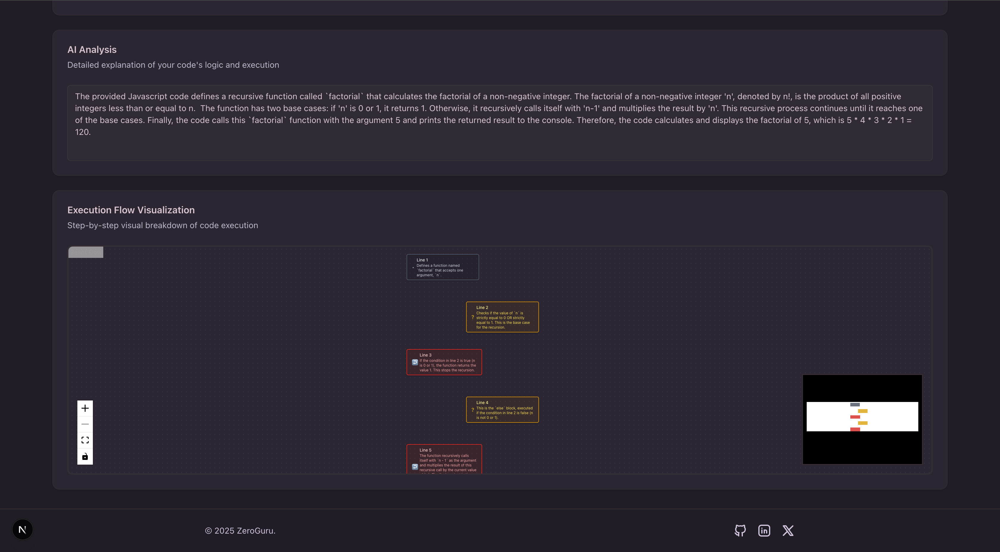

# ZeroGuru

**Understand Code Execution with Gemini AI**

ZeroGuru is an innovative Next.js web application that leverages Google's Gemini AI to provide intelligent code analysis and step-by-step execution flow explanations. Designed for developers, educators, and learners, it helps break down complex code logic into understandable visualizations, supporting multiple programming languages including JavaScript, Python, Java, C++, and more.

The app features an interactive Monaco Editor for code input, real-time AI-powered analysis, and dynamic React Flow visualizations that illustrate code execution paths. Built with modern web technologies, it offers a responsive design with dark theme and includes rate limiting to ensure fair usage.

## Screenshots

_Main interface with code editor and language selection_

_AI-generated code analysis and execution flow visualization_

## Features

- **AI-Powered Code Analysis**: Input code in multiple programming languages and receive detailed, AI-generated explanations of functionality, logic, and purpose
- **Step-by-Step Execution Breakdown**: Interactive flowcharts showing each line's execution with type classification (assignment, condition, loop, etc.)
- **Multi-Language Support**: Comprehensive coverage for JavaScript, Python, Java, C++, and additional languages
- **Interactive Code Editor**: Monaco Editor with syntax highlighting, auto-completion, and error detection
- **Visual Execution Flow**: React Flow-based diagrams for intuitive code path visualization
- **Rate Limiting**: Built-in protection against abuse with 2 requests per minute per IP
- **Responsive Design**: Modern UI with dark/light theme support using Tailwind CSS and Shadcn UI components

## Tech Stack

- **Frontend Framework**: Next.js 16 with React 19
- **AI Integration**: Google Gemini AI (gemini-2.5-flash-lite model)
- **Code Editor**: Monaco Editor (@monaco-editor/react)
- **Visualization**: React Flow for interactive diagrams
- **UI Components**: Radix UI primitives with Lucide React icons
- **Styling**: Tailwind CSS with custom animations
- **Rate Limiting**: rate-limiter-flexible for API protection
- **Build Tools**: ESLint for linting, PostCSS for styling

## How It Works

1. **Code Input**: Select a programming language from the dropdown and enter code in the Monaco editor
2. **AI Analysis**: Click "Analyze Code" to send the code to the backend API
3. **Gemini API Processing**: The server uses Google's Gemini AI to generate a structured JSON response containing:
   - A comprehensive explanation of the code's functionality and logic
   - A step-by-step breakdown of execution with line numbers and descriptions
4. **Visualization**: View the detailed explanation and interactive execution flow diagram

## Usage

1. Select a programming language from the dropdown
2. Enter code in the Monaco editor
3. Click "Analyze Code" to get AI analysis
4. View the detailed explanation and execution flow visualization

## Challenges I ran into

One of the main challenges was integrating the Gemini AI API effectively to generate structured JSON responses for code analysis and execution flows. Ensuring the AI output was consistent and parseable required careful prompt engineering. Another challenge was implementing the interactive flow visualization with React Flow, particularly handling complex code structures and making the diagrams intuitive. Rate limiting implementation also required careful consideration to balance user experience with API protection.

## What I learned

Through building ZeroGuru, I gained deep insights into AI integration, particularly working with large language models like Gemini for code analysis. I learned about prompt engineering techniques to generate structured outputs. The project also taught us about modern React development with Next.js 16 and React 19, as well as working with complex visualization libraries like React Flow.

## Rate Limiting

- 2 requests per minute per IP address
- Returns 429 status code when limit exceeded

## Team

**Project Lead & Developer**: zeropse (solo project)

This project was built entirely by me.
